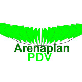

# Arenaplan - Landing Page

<div align="center">
  
  
  **Premium landing page for Arenaplan Smart PDV**
  
  [](https://vercel.com/new/clone?repository-url=https%3A%2F%2Fgithub.com%2Fdpagency%2Farenaplan-landing-page)
</div>

## 📋 Sobre

Arenaplan é um sistema completo de PDV (Ponto de Venda) com:
- ✅ Cupom fiscal integrado
- 📊 Gestão de negócios em tempo real
- 📱 Interface moderna e responsiva
- 🔐 Segurança de dados
- ⚡ Performance otimizada

Esta é a landing page oficial que apresenta os recursos e vantagens do Arenaplan Smart PDV.

## 🚀 Quick Start

### Pré-requisitos
- Node.js 18+ 
- npm ou yarn

### Instalação

1. Clone o repositório:
```bash
git clone https://github.com/dpagency/arenaplan-landing-page.git
cd arenaplan-landing-page
```

2. Instale as dependências:
```bash
npm install
```

3. Inicie o servidor de desenvolvimento:
```bash
npm run dev
```

A aplicação estará disponível em `http://localhost:3000`

## 📦 Build para Produção

```bash
npm run build
npm run preview
```

## 🔧 Variáveis de Ambiente

Esta é uma **landing page estática** e não requer variáveis de ambiente.

## 🛠️ Tecnologias

- **React 19** - Framework UI
- **Vite 6** - Build tool
- **TypeScript** - Type safety
- **Tailwind CSS 4** - Styling
- **Motion** - Animações fluidas
- **Lucide React** - Icons

## 📱 Recursos

- Página responsiva mobile-first
- Otimizada para performance (Lighthouse)
- SEO-friendly com meta tags
- Dark mode
- Integração com WhatsApp
- Animações suaves com Motion

## 🚀 Deployment

### Vercel (Recomendado)

1. Push o código para GitHub
2. Conecte o repositório ao Vercel
3. Configure as variáveis de ambiente
4. O deployment automático será acionado

[](https://vercel.com/new/clone?repository-url=https%3A%2F%2Fgithub.com%2Fdpagency%2Farenaplan-landing-page)

### Outras plataformas

- **GitHub Pages**: Compatível (requer ajuste de base URL)
- **Netlify**: Compatível
- **Docker**: Use a configuração base Node.js

## 📝 Scripts Disponíveis

```bash
npm run dev         # Inicia servidor de desenvolvimento
npm run build       # Build para produção
npm run preview     # Preview da build de produção
npm run type-check  # Verifica tipos TypeScript
npm run lint        # Lint do código
npm run clean       # Remove pasta dist
```

## 📞 Suporte

Para dúvidas ou sugestões sobre a landing page:
- WhatsApp: https://wa.me/5511982915313
- Website: https://Arenaplan.com.br
- Email: contato@dpagency.com.br

## 📄 Licença

Apache License 2.0 - Veja [LICENSE](LICENSE) para mais detalhes.

## 👥 Desenvolvido por

[DP Agency](https://dpagency.com.br) - Agência de desenvolvimento de software

---

Feito com ❤️ para Arenaplan
